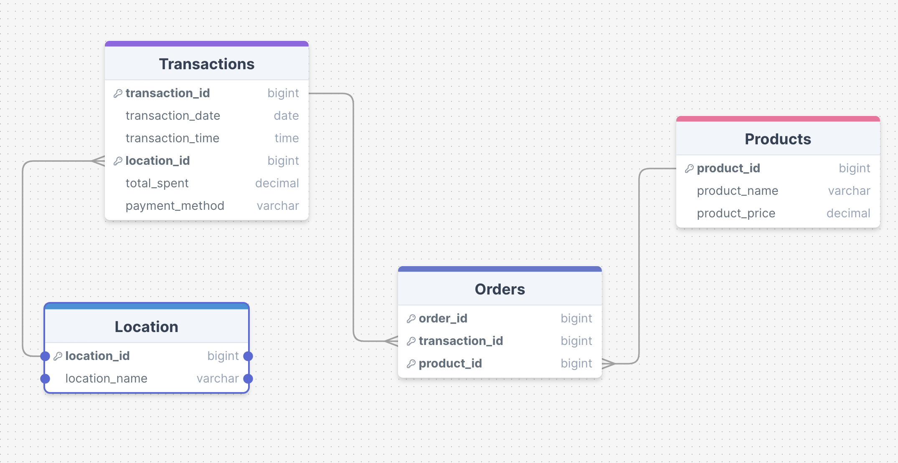

# Final-project
## About

This project does blah blah

## Elevator pitch:
*FOR* the super cafe owner 

*WHO* need their data data organised by:
* Sales
* Performance
* Products
* Stores

*THE* NUBI service 

*IS* a data engineering service 

*THAT* creates structure, organisation and security to build clear reports using data visualisations

*UNLIKE* manual processing of data and having separate disjointed forms of data

*OUR SERVICE* automates data organisation and visualisation offering real time insights into sales and operations. 
Our service ensures customer privacy (names, card number, etc.)

## Team Members

* Haaris H
* Byron S
* Taiwo A
* Mujtaba M

## Database Schema Model

 # Sprint 1 - ETL

To run ETL using files provided:

 1. Copy and Paste "Nubi_setup.sql" into adminer
 2. Run load.py